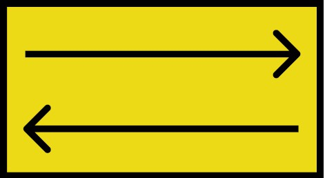

# Ciencia de Datos y La Inteligencia Artificial

> Citando a Phil Collins “Dos Mundos Son”

## Diagrama de Venn Ciencia de Datos y la IA

Eso quiere decir que lo vemos como conjuntos 
cada una son dos conjuntos diferentes. 
No son conjuntos muetamente excluyentes
De hecho por el contrario 
Comparte muchas caractersiticas en común. 

---

Ambos se apoyan de las mátematicas, 
la programación, las bases de datos, 
para realizar sus actividades 
De igual forma cuando ambas se 
combinan con otros disiciplinas 
tiene muchas posibilidades
y aplicaciones me atreveria a 
decir que infinitas 

---

Tambien podriamos decir que ambas 
tiene una relación simbiotica, 
porque ambas se necesitan 
mutuamente para lograr objetivos que 
por separado no serian  capaces 
de lograr. 

---

La IA utiliza la Ciencia de datos
para realizar sus tareas.
Como para que mediante una 
fotografía de una persona 
para averiguar si el genero 
y la edad de la persona. 
Como Watson de IBM 

---

Y viciversa Ciencia de datos 
necesita de la IA. 
Como un analisis estadistico 
del crecimiento de las algas 
de un lago,  y entones 
crear un Maching Lerning que 
prediga el crecimiento de las
dichas algas en el futuro.  

---

El habla de IA nos lleva a hablar de temas 
filosoficos, eticos y morales. Sin embargo 
seria un error decir que la Cienca de Datos 
tampoco habla de esos temas. 
Como si es moralmente correcto 
usar los datos de una persona 
para realizar campañas de publicidad,
conciderando que estamos violando su 
privacidad. 
Y esto nos dara para discutir 
más y más temas. 

---

## Entonces cual es la diferencia entre ambos

Me atreveria a decir que la diferencia 
radica en el enfoque que le demos. 
Ya que no necesarimente todos las 
aplicaciones de la Ciencia de Datos 
necesitan una IA. 
Aunque entre más datos generamos 
más necesitamos que sean procesados 
y una persona ya no es suficiente para eso.
lo que nos lleva a implementar maching
learning para procesar dichos magnitudes
de datos.  

---

En una conferencia sobre el origen de la ciencia de datos
El ponente (qué es fisico) cuenta la historia de Johannes 
Kepler queria saber porque los planetas se mueven como
se mueven, pero como faltaban años para que Newton 
inventara el calculo entonces dibujo los movimientos de
los planetas con la epseranza de que alguien lo descubirera 
en el futuro.  Esa es al ecencia de la ciencia de datos 
Almacenar datos para su utilización en el futuro. 

Quizas haya  notado que en nuestro Diagrama de Venn
El conjunto de la IA es ligeramente más grande que 
el conjunto de la Ciencia de Datos esto es porque aunque 
ya hemos visto que ambos estan fuertemente relacionados
la IA es aun un conjunto más grande por explorar. 
Ya que como mencionamos la Cienca de Datos 
se enfoca en almacenar datos para su posterior 
consulta. Para la IA esta es solo una de las labores que se 
puede aplicar con ella.  
Ambos se nutren de sus descubrimientos mutuamente 
solo que si vieramos esto como una carrera 
entre más crece la Ciencia de Datos más crece 
la Inteligencia Artificial. 

---

## Fuentes y Referencias

- Murtaza Haider. (2015). Getting Started with Data Science. 26 de febrero del 2021, de IBM/Coursera 

[Sitio web:](https://cf-courses-data.s3.us.cloud-object-storage.appdomain.cloud/IBMDeveloperSkillsNetwork-DS0101EN-SkillsNetwork/labs/Module%201/Reading_What_Makes_Someone_DataScientist.md.html?origin=www.coursera.org)

- COMUNICACIÓN EADIC . (2019). Inteligencia Artificial vs Aprendizaje Automático +vs Deep Learning vs Ciencia de Datos. 26 de febrero del 2021, de eadic 

[Sitio web:](https://www.eadic.com/inteligencia-artificial-vs-aprendizaje-automatico-vs-deep-learning-vs-ciencia-de-datos/#:~:text=La%20Ciencia%20de%20Datos%20(Data,la%20que%20toma%20la%20acci%C3%B3n).)
 
- Francisco Herrera Triguero. (2018).Ciencia de Datos e Inteligencia Artificial. 26 de Febrero del 2021, 
de Livemetric/Unidad de Excelencia URG 

[Sitio web:](https://livemetrics.ugr.es/unidad-excelencia/computacion-e-inteligencia-artificial/)

- Favio Vázquez. (2020). Seminario TIC - Las raíces de la ciencia de datos. 
26 de Febrero del 2021, de YouTube/DGTIC/Aprende TIC UNAM 

@[youtube](id|https://www.youtube.com/live/lZwZSLkDEj4?feature=share)

---

Este infografia primero fue creada en Figma para tener una idea del diseño por si lo quieren ver esta es la dirección. 

[Figma](https://www.figma.com/proto/najbsQzCilJNJyExIYFuaa/Ciencia-de-Datos-y-La-Inteligencia-Artificial?type=design&node-id=12-0&t=zV7qj2FYdcKrqASS-0&scaling=min-zoom&page-id=0%3A1)

